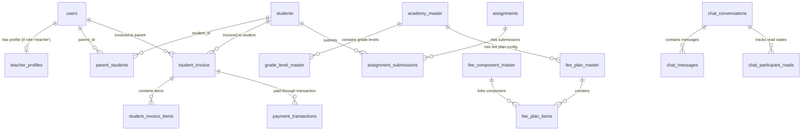

# TIA Global Backend - System Architecture & Technical Documentation

This document provides a comprehensive, deep technical analysis of the **TIA Global Backend** codebase. It outlines the system architecture, database schema, module functionality, key workflows, and middleware logic.

---

## 1. Overview & Core Technology Stack

The TIA Global Backend is a professional, modular **Node.js** application built using **Express.js** and **MySQL**. It incorporates real-time communications via **Socket.io** and handles automated transactional emails using **Nodemailer**.

### Tech Stack Details
* **Runtime Environment**: Node.js (v18+)
* **Web Framework**: Express.js
* **Database**: MySQL (relational, accessed via `mysql2/promise` connection pooling)
* **Real-time WebSockets**: Socket.io (version 4.8.x)
* **Authentication**: JSON Web Tokens (JWT) & Bcrypt password hashing
* **Security & Network**: Helmet (configured for custom Cross-Origin Resource Policies), CORS, Multer (multipart/form-data for file uploads)
* **Logging & Debugging**: Chalk-based custom console logging, request body/query masking for privacy

---

## 2. Directory Structure

The project follows a clean modular design where features (Users, Payments, Chat, Assignments, Dashboard, Events) are self-contained inside the `src/modules` directory.

```
Tiaglobal_backend/
├── database/                    # SQL migration and seed scripts
├── docs/                        # API & WebSocket documentation, Postman collections
├── public/                      # Static client assets (HTML/CSS/JS for chat & resets)
├── src/
│   ├── app.js                   # Express application setup & middleware registration
│   ├── config/                  # Configuration files (DB pool, env variables)
│   ├── middlewares/             # Security, Auth, Upload, and Payment validation middlewares
│   ├── modules/                 # Modular business logic divided into components
│   │   ├── admin/               # Admin features (auth, events, user approvals)
│   │   ├── assignments/         # Assignment posting, submission, and grading
│   │   ├── chat/                # Real-time WebSocket chat service, models, and socket handlers
│   │   ├── dashboard/           # Summary metrics for parents, students, and teachers
│   │   ├── events/              # Event calendar/bulletin board for parents, students, and teachers
│   │   ├── payment/             # Configurable fee structure, invoicing, and transactions
│   │   └── users/               # Core user authentication and student creation
│   ├── routes/                  # REST Router combining module route handlers
│   ├── socket/                  # Main Socket.io entry point, auth handshakes, and debug logging
│   └── utils/                   # Helpers (API errors, route logging, PDF invoice generation)
├── server.js                    # Server startup entry point (DB connection check, listener, local IP finder)
└── setup_database.js            # Automated database table creation and seed execution
```

---

## 3. Database Architecture & Schema Relationships

The database is powered by MySQL. Relationships are maintained using foreign keys. The diagram below illustrates the entity connections.



### Table Breakdown

1. **Core Users & Profiles**:
   * `users`: Stores parents, teachers, and admins. Columns include `role` (`parent`, `teacher`, `admin`), credentials, `approval_status` (`pending`, `active`, `inactive`), and `profile_image`.
   * `students`: Stores student records. Contains `grade_level`, `academy`, `status` (`pending`, `active`), `is_first_login`, and `is_password_generated`.
   * `parent_students`: Many-to-many mapping table linking parents to their children.
   * `teacher_profiles`: Extra details for teachers (qualifications, experience, teaching grades).

2. **Fee Structures & Payments**:
   * `academy_master`: Stores school categories (e.g., Global Academy, Religious Academy).
   * `grade_level_master`: Grade definitions (Pre-K, Kindergarten, 1st Grade, etc.).
   * `fee_component_master`: Types of fees (Tuition, Enrollment, Technology Fee, Textbook, etc.).
   * `fee_plan_master`: High-level fee configs mapping academies to new or returning students.
   * `fee_plan_items`: Amounts designated for each fee component in a fee plan.
   * `discount_master`: Stores automated discount configurations (sibling discount, full tuition payment discount).
   * `student_invoice` & `student_invoice_items`: Record of generated student bills, tracking subtotal, applied discounts, grand totals, and payments.
   * `payment_transactions`: Tracks payment history, currency, amount, gateway response, and status (`success`, `failed`, `pending`).

4. **Academic Modules**:
   * `assignments`: Homework details created by teachers targeting specific grade levels.
   * `assignment_submissions`: Tracks student uploads, graded marks, feedback, and status.
   * `events` & `event_student_grades`: Events posted by admins targeted at all users or selected student grades.

5. **Real-time Communication**:
   * `chat_conversations`: Holds parent-teacher or student-teacher private chat rooms.
   * `chat_messages`: Chat logs.
   * `chat_participant_reads`: Read-receipt metadata tracking up to which message ID a participant has viewed.

---

## 4. Key Workflows & Business Logic

### A. Authentication & RBAC (Role-Based Access Control)
* JWTs are used for all authentication. 
* Express routes use the [verifyToken](file:///Users/abcd/Desktop/desktop/Tiaglobal_backend/src/middlewares/auth.middleware.js#L4) and [authorizeRoles](file:///Users/abcd/Desktop/desktop/Tiaglobal_backend/src/middlewares/auth.middleware.js#L21) middlewares.
* The system enforces role-based endpoint permissions. E.g., `teacher` cannot call payment routes; `student` cannot post assignments.

### B. Cascading User Approval Flow (Admin Action)
Admin approvals follow a cascading rule set defined in [admin.users.service.js](file:///Users/abcd/Desktop/desktop/Tiaglobal_backend/src/modules/admin/users/admin.users.service.js):
1. **Student Status set to 'active'**:
   * Auto-activates their linked Parent user (enabling parent login).
   * If the student does not have a password yet, the system generates a secure temporary password, hashes it, sets `is_password_generated = 0`, and emails it to the student.
2. **Parent Status set to 'active'**:
   * Auto-activates the Parent user.
   * Auto-activates **all** linked pending children (students).
   * Generates, hashes, and emails temporary passwords to all activated children.
3. **Password Configuration Flag**:
   * When using the temporary password, the backend returns `isPasswordGenerated: false`, signaling the client to force a custom password reset.
   * Once a custom password is set, the flag `is_password_generated` is set to `1` in the database, updating it to `true`.

### C. Academic Blockade Middleware
To enforce prompt fee payments, the system includes a [requireStudentPayment](file:///Users/abcd/Desktop/desktop/Tiaglobal_backend/src/middlewares/requireStudentPayment.middleware.js) middleware:
* Intercepts academic features (Dashboard, Assignments, grading details).
* If the Student has no invoice marked `'paid'`, the middleware blocks the request, returning a `403 Payment Required` JSON body specifying the invoice status.
* When parents access these routes for a child, the middleware checks payment status using the query parameter `studentId`.

### D. Fee Invoicing System
Invoices are dynamically calculated in [payment.service.js](file:///Users/abcd/Desktop/desktop/Tiaglobal_backend/src/modules/payment/payment.service.js):
1. **Fee Calculation**: Checks whether the student is "new" (having no past paid invoices) or "returning".
2. **Plan Lookup**: Fetches active plans matched against the student's academy.
3. **Discounts**: Detects and applies active discounts, such as a **Sibling Discount** (if the parent has multiple registered active children) or full payment discounts.
4. **Snapshot Preservation**: The generated invoice stores a JSON snapshot of the calculations (`calculation_snapshot`) in the database for billing audit integrity.

### E. WebSocket Messaging Namespace
Real-time chat features are structured in [chat.socket.js](file:///Users/abcd/Desktop/desktop/Tiaglobal_backend/src/modules/chat/chat.socket.js):
* **Handshake Authentication**: The socket handler extracts and validates bearer tokens on connection.
* **Room Subscriptions**:
  * Users join a unique private room: `user:{role}:{id}`.
  * Active chats use conversation-specific rooms: `conversation:{id}`.
* **Conversations**: Messages are transmitted using Socket event handlers (`chat:message:send` / `chat:messages` / `chat:read`).
* **Real-time updates**: Emits `chat:message:new` inside the room, and broadcasts `chat:list:update` to participants' private rooms to instantly update message badges and preview lists.

---

## 5. Main Midde-tiers (Middlewares) Analysis

* **[auth.middleware.js](file:///Users/abcd/Desktop/desktop/Tiaglobal_backend/src/middlewares/auth.middleware.js)**:
  Extracts JWT headers, parses user role/id payload, and applies endpoint access scopes.
* **[admin.middleware.js](file:///Users/abcd/Desktop/desktop/Tiaglobal_backend/src/middlewares/admin.middleware.js)**:
  Dedicated checker verifying the admin's secret token and role type.
* **[requireStudentPayment.middleware.js](file:///Users/abcd/Desktop/desktop/Tiaglobal_backend/src/middlewares/requireStudentPayment.middleware.js)**:
  Enforces academic locking based on billing invoice statuses.
* **[upload.middleware.js](file:///Users/abcd/Desktop/desktop/Tiaglobal_backend/src/middlewares/upload.middleware.js) & [assignmentUpload.middleware.js](file:///Users/abcd/Desktop/desktop/Tiaglobal_backend/src/middlewares/assignmentUpload.middleware.js)**:
  Configures Multer destination pathways (`public/uploads`) for profile images and homework documents.
* **[errorHandler.js](file:///Users/abcd/Desktop/desktop/Tiaglobal_backend/src/middlewares/errorHandler.js)**:
  Catches application-level crashes, translates them to human-readable API alerts, and returns clean error payloads to prevent sensitive database traces leakage.

---

## 6. How to Start the System

1. **Environments Setup**:
   Configure the `.env` variables (Database host, credentials, ports, mail credentials).
2. **Setup Database Structure**:
   ```bash
   node setup_database.js
   ```
3. **Run Backend**:
   * Local Development: `npm run dev` (starts Nodemon server)
   * Production: `npm run prod` (standard Node runner)
